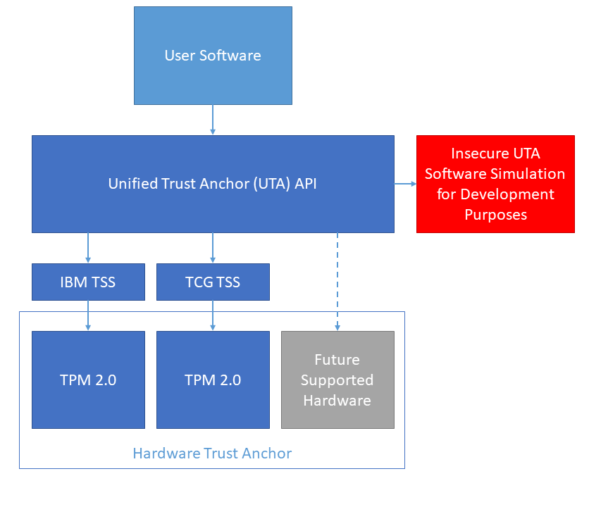

# Unified Trust Anchor API


[](COPYING)

This project is a proof-of-concept implementation of the Unified Trust Anchor
API, allowing the usage of different hardware trust anchor and a software
simulator with a uniform interface.



## Contents
   * [Unified Trust Anchor API](#unified-trust-anchor-api)
      * [Contents](#contents)
      * [Design Concept](#design-concept)
      * [Getting Started](#getting-started)
         * [Prerequisites](#prerequisites)
         * [Installing](#installing)
         * [Debian packaging](#debian-packaging)
            * [Dependencies](#dependencies)
            * [Configuration](#configuration)
            * [Remarks](#remarks)
      * [Tools](#tools)
         * [Regression tests](#regression-tests)
         * [Retrieve a passphrase from the trust anchor](#retrieve-a-passphrase-from-the-trust-anchor)
      * [Library structure](#library-structure)
         * [Return codes](#return-codes)
         * [UTA version](#uta-version)
         * [UTA context](#uta-context)
         * [UTA API](#uta-api)
         * [Function description](#function-description)
            * [uta_init_v1](#uta_init_v1)
            * [context_v1_size](#context_v1_size)
            * [open](#open)
            * [close](#close)
            * [len_key_max](#len_key_max)
            * [derive_key](#derive_key)
            * [get_random](#get_random)
            * [get_device_uuid](#get_device_uuid)
            * [self_test](#self_test)
            * [get_version](#get_version)
      * [Setting up the IBM software stack](#setting-up-the-ibm-software-stack)
      * [TPM-Provisioning](#tpm-provisioning)
      * [Thread safety](#thread-safety)
      * [UTA Key Hierarchy](#uta-key-hierarchy)
         * [TPM IBM](#tpm-ibm)
      * [Coding Standard](#coding-standard)
      * [Versioning](#versioning)

## Design Concept
The Unified Trust Anchor API is designed to provide a small set of functions
with only a few selectable parameters to support a large number of hardware
trust anchor, even very small ones. This allows the user software to run on
different hardware architectures and devices using the same API to access the
hardware trust anchor, independent of the actually used trust anchor and how it
has to be accessed. Another important goal was the design of an API
which decreases the probability of using it the wrong way. The two main
functions the trust anchor must support are a random number generator and a key
derivation using the HMAC function. Currently two key slots are used to allow
key derivations for different use-cases, so that one key slot could contain a
device individual key, the other key slot could contain a preshared key used
for secure communication.

## Getting Started
The following instructions will get you a copy of the project up and running on
your local machine.

### Prerequisites
`build-essential` needs to be installed to build the project. The `./bootstrap`
command needs the package `libtool`. To use the library with a TPM, the IBM
software stack has to be installed! (See [Setting up the IBM software stack](#setting-up-the-ibm-software-stack))

### Installing
After cloning the repository, the necessary autotools files must be generated.
Therefore, `libtool` has to be installed. This step is not needed if a release
of this software is created with `make dist`.
```
./bootstrap
```

To see all the possible configuration options, run:
```
./configure -h
```

To additionally compile and install the command line tools add `--enable-tools`
to the configuration arguments.
```
./configure HARDWARE=XXX --enable-tools
```

The configuration of the TPM_IBM variant needs some handle numbers, which are 
defined during the provisioning of the TPM (see
[TPM-Provisioning](#tpm-provisioning)). The default handle numbers are:
* KEY0_HANDLE=0x81000000
* KEY1_HANDLE=0x81000001
* SALT_HANDLE=0x81000002

If one or more handle numbers are missing, the default values are used.
```
./configure HARDWARE=TPM_IBM KEY0_HANDLE=0x81000000 KEY1_HANDLE=0x81000001 SALT_HANDLE=0x81000002
```

Furthermore, there are configuration options for the IBM TSS. The default
values are the following:
* TPM_IBM_INTERFACE_TYPE=dev
* TPM_IBM_DEVICE=/dev/tpmrm0
* TPM_IBM_DATA_DIR=/var/lib/tpm_ibm

If no TPM resource manager is available on the system, multiprocessing is not
supported an has to be disabled using `--without-multiprocessing` to pass the
regression tests.

To use the UTA software simulator run
```
./configure HARDWARE=UTA_SIM
```

After the configuration of the hardware variant the project can be compiled using
```
make
```

The project can be installed running
```
sudo make install
```

To update the systems shared library cache run
```
sudo ldconfig
```

### Debian packaging

#### Dependencies

```
debhelper dpkg-dev autotools-dev pkg-config
```
For packaging the TPM_IBM variant of the library, the IBM TSS must be installed
on the build machine.

#### Configuration
* First `./bootstrap` has to be invoked
* For each hardware configuration, a separate Debian package has to be built
* The configuration of the trust anchor type is done by calling the
  `debian/configure` script.
* After valid configuration, build package using regular Debian package command:
  `$ dpkg-buildpackage -us -uc`
* The resulting package is built into higher (`../`) directory
* `libuta-dev` package is built in every case and contains the header files
  needed for development
* `libuta-derive-tool` package contains the `uta_get_passphrase` tool described below
* Platform-specific `libuta` libraries are set to conflict to each other, you
  may have only one installed at one platform.

#### Remarks
* Currently the packaging does not contain the UTA uta_reg_test command line tool.

## Tools
The project containes some command line tools, which can be compiled using the
configuration flag `--enable-tools` during `./configure`. After `make install`
the tools are globally executable.

### Regression tests
The regression tests can be started using
```
uta_reg_test [<key0_file.bin>] [<key1_file.bin>]
```
with the paths to the key files of slot 0 and slot 1 as optional parameters. If
the key files are provided, the regression tests calculate the output of the key
derivation in software and compare it with the output of the trust anchor. If
uta_reg_test ist called without the key files, only the return codes of the
trust anchor calles are checked. The RNG test is a statistical test, designed to
find critical errors, such as implementation errors. If the test passes, it does
NOT automatically mean that the random numbers have a high quality! Please refer
to the NIST for details about testing random number generators.
By default der following UTA API calles are tested:
* get_version
* get_device_uuid
* self_test
* get_random (64 Bytes of random numers are collected from the trust anchor and
  analyzed using a chi-squared test)
* derive_key using key slot 0 and key slot 1 (checked against software
  implementation if the keys are provided to the regression test)

After performing all the test once, multiple threads are spawned to check the
thread safety. Fork() is used to create a child process and both processes
create multiple threads. The threads perform the same tests as before.

### Retrieve a passphrase from the trust anchor
The tool `uta_get_passphrase` can be used to retrieve a passphrase from the
trust anchor. It basically derives a cryptographic key with a given derivation
value and key slot and encodes the key to printable characters. The passphrase
is printed to stdout and can easily be piped to other applications that accept a
passphrase on stdin. For example the
[LUKS](https://gitlab.com/cryptsetup/cryptsetup/blob/master/README.md) framework
for hard disk encryption can receive a passphrase this way.

```
$ ./uta_get_passphrase -h
### Retrieve passphrase from the UTA trust anchor ###

Usage: uta_get_passphrase [-d <derivation_string>] [-e <encoding>] [-k <key slot>] [-h]

-d <derivation_string>: string used in the computation of passphrase,
   maximum length is 8 characters; (default value: 'default!')
-e <encoding>: select encoding of the passphrase from
   'base64' and 'hex'; (default: 'base64')
-k <key slot>: select the key slot;
   (default: 1)
-h This help message
```

The following two calls of the tool are equivalent:
```
$ ./uta_get_passphrase
FoqVaXPagmUfivixH4oG6LEZDNmY1tsJ4FsEKX8B/a8

$ ./uta_get_passphrase -d default! -e base64 -k 1
FoqVaXPagmUfivixH4oG6LEZDNmY1tsJ4FsEKX8B/a8
```

## Library structure
This chapter describes the structure of the UTA library and gives examples on
how to use it.

### Return codes
The return codes of the functions are 32 bit unsigned integers called uta_rc.
```c
typedef uint32_t uta_rc;
```
The following error codes are currently defined:
```c
#define UTA_SUCCESS             0x00
#define UTA_INVALID_KEY_LENGTH  0x01
#define UTA_INVALID_DV_LENGTH   0x02
#define UTA_INVALID_KEY_SLOT    0x03
#define UTA_TA_ERROR            0x10
```

### UTA version
The version of the library can be requested with `get_version`. It is defined as
a struct containing the used trust anchor and the major, minor and patch number
(See [Versioning](#versioning)).
```c
typedef struct {
      enum {UTA_SIM=0, TPM_IBM=1, TPM_TCG=2} uta_type;                
      uint32_t major;
      uint32_t minor;
      uint32_t patch;
} uta_version_t;
```

### UTA context
The context of the UTA is used to get rid of global variables inside the library
and to create a status free library. It is an opaque structure and therefore the
elements are not known to the user.
```c
typedef struct _uta_context_v1_t uta_context_v1_t;
```

### UTA API
For higher extendibility and flexibility only an initilization function is
exported. The user can request a certain version of the API with the
corresponding init function. This function returns a struct with the function
pointers of the desired version.
```c
extern uta_rc uta_init_v1     (uta_api_v1_t *uta);
```
The struct with the v1 functions is shown here:
```c
typedef struct {
   size_t (*context_v1_size)  (void);
   size_t (*len_key_max)      (void);
   uta_rc (*open)             (const uta_context_v1_t *uta_context);
   uta_rc (*close)            (const uta_context_v1_t *uta_context);
   uta_rc (*derive_key)       (const uta_context_v1_t *uta_context, uint8_t *key, size_t len_key, const uint8_t *dv, size_t len_dv, uint8_t key_slot);
   uta_rc (*get_random)       (const uta_context_v1_t *uta_context, uint8_t *random, size_t len_random);
   uta_rc (*get_device_uuid)  (const uta_context_v1_t *uta_context, uint8_t *uuid);
   uta_rc (*self_test)        (const uta_context_v1_t *uta_context);
   uta_rc (*get_version)      (const uta_context_v1_t *uta_context, uta_version_t *version);
} uta_api_v1_t;
```
For version 1 of the API, the following define contains the implemented dv length of 8 Bytes.
```c
#define UTA_LEN_DV_V1   8
```

### Function description
In the following subsections the implemented functions are desribed and minimal
examples are given. ```NOTE``` that the return codes have to be evaluated by the
user after each function call!

#### uta_init_v1
This function initializes the version 1 of the UTA API and returns a struct with
the corresponding function pointers.
```c
// Allocate memory for the struct with the function pointers
uta_api_v1_t uta;
// Initialize the v1 API
rc = uta_init_v1(&uta);
```

#### context_v1_size
This function is needed to allocate memory for the context, because the user
does not know the size of the context. An example would be:
```c
// Allocate memory for the pointer to the context
const uta_context_v1_t *uta_context;
// Allocate memory for the context
uta_context = malloc(uta.context_v1_size());
```

#### open
After allocationg memory for the context, the open function can be called.
Depending on the underlying hardware trust anchor it could be that the open
function blocks the device file and should be therefore called immediately
before other requests to the trust anchor, followed by the close function. It
can be done very local in the user code.
```c
rc = uta.open(uta_context);
```

#### close
The close function deletes the context variables and frees the device file. It
should be called immediately after the last request to the trust anchor.
```c
rc = uta.close(uta_context);
```

#### len_key_max
This function can be used to request the highest key length (in Bytes), which
can be returned by the derive key function.
```c
size_t len_key_max = uta.len_key_max();
```

#### derive_key
Derives a key from the trust anchor using the derivation value given in `dv` and
it's length `len_dv`. The trust anchor uses the key inside the given `key_slot`.
Currently the trust anchor uses SHA256 as the HMAC hash function. The user can
request a number of bytes between 0 and 32 given in `len_key`. The number of
bytes are written to `key`. The in version 1 implemented dv length is 8 Bytes.
If key_slot, len_key or len_dv are outside their defined range, the function
returns the corresponding uta_rc error value. The function `len_key_max()` can
be used to request the highest key length of each version. The define
`UTA_LEN_DV_V1` contains the implemented dv length (8 Bytes) of version 1.
```c
uint8_t key[32];
uint8_t *dv = (unsigned char *)"*passwd*";
rc = uta.derive_key(uta_context, key, 32, dv, 8, 0);
```
The example returns 32 Bytes to key by calculating a HMAC over the 8 Byte
derivation value dv using the key in slot 0.

#### get_random
Writes `len_random` number of random bytes to `random`.

**PLEASE NOTE:** The quality of the random data depends on the used hardware
trust anchor. So we cannot guarantee that the retrieved random data is suitable
for cryptographic applications. **Therefore, we strongly recommend to use the
output of this function exclusively for seeding of cryptographically secure
pseudorandom number generators (CSPRNGs) such as implemented in the Linux kernel
or in OpenSSL.**

```c
uint8_t random[20];
rc = uta.get_random(uta_context, random, 20);
```

#### get_device_uuid
Returns a 16 Byte `uuid` which is formatted as defined by
[RFC4122](https://tools.ietf.org/html/rfc4122). The creation of the UUID depends
on the trust anchor.
```c
uint8_t uuid[16];
rc = uta.get_device_uuid(uta_context, uuid);
```

#### self_test
Performs a self test on the trust anchor and returns the result as uta_rc.
```c
rc = uta.self_test(uta_context);
```

#### get_version
Returns a struct [uta_version_t](#uta-version) containing the used trust anchor
and version number.
```c
uta_version_t version;
rc = uta.get_version(uta_context, &version);
```

## Setting up the IBM software stack
* The software stack comes packaged in debian. The package `libtss-dev` needs
  to be installed.  
* In order to allow non-root users the access to the TPM, we create a group
  tpm and setup udev rules. The following configuration steps are only for
  reference and should be adjusted during integration:
    * Add group tpm `sudo groupadd tpm`
    * Add tpm group to user `sudo usermod -aG tpm <username>`
    * Create a udev rule file under `/etc/udev/rules.d/80-tpm-2.rules` and add
      the following lines:
      ```
      KERNEL=="tpm[0-9]*", MODE="0660", OWNER="root", GROUP="tpm"
      KERNEL=="tpmrm[0-9]*", MODE="0660", OWNER="root", GROUP="tpm"
      ```
  * Create a udev rule file under `/etc/udev/rules.d/80-tpm-2.rules` and add
    the following lines:
    ```
    sudo mkdir -p /var/lib/tpm_ibm
    chown root:tpm /var/lib/tpm_ibm
    chmod 0770 /var/lib/tpm_ibm
    ```

## TPM-Provisioning
In addition to the `libtss-dev` package, the `tss2` package must be installed
to provision the device.
* Copy the 2 key files with 32 Byte keys to the location of the
  `provisioning.sh` script (`src/provisioning/tpm_ibm/`) and name them
  `key0.bin` and `key1.bin`. (Random keys can be generated using
  `dd if=/dev/random of=key0.bin bs=32 count=1`)
* The default handle numbers of the key files and configuration options for
  the IBM TSS are hardcoded in the provisioning script and must match the
  configuration of the libuta
* Run `sh provisioning.sh`
* Securely remove the plain key files from the system

## Thread safety
The hardware trust anchor are shared resources and therefore, the access must
be controlled. This highly depends on the used hardware trust anchor, e.g. the
TPM_TCG provides an optinal ABRMD (Access Broker and Resource Manager Daemon), 
which handles the access. In newer Linux Kernel implementations there is also
a TPM resource manager available.

NOTE: If no TPM resource manager is available on the system, multiprocessing is
not supported an has to be disabled using `--without-multiprocessing` to pass
the regression tests.

## UTA Key Hierarchy
Due to different trust anchor architectures, the key hierarchy differs in the
implementation. For the end user it does not make a difference.

### TPM IBM
The TPM uses the storage hierarchy to store the keys of slot 0 and slot 1. They
are inserted during provisioning and stored in persistent key slots. During
provisioning an ECC key pair is generated and stored in a persistent key slot as
well. It is used for parameter encryption. The `device UUID` is derived from the
primary HMAC key in the endorsement hierarchy using the 8 Byte string
"DEVICEID".
```
 Endorsement hierarchy           Storage hierarchy
+----------------------+ +-------------------------------+
| +------------------+ | |    +---------------------+    |
| | Primary HMAC key | | |    | Primary storage key |    |
| +---------+--------+ | |    +----+-----------+----+    |
|           |          | |         |           |         |
|       DEVICEID       | |         |           |         |
|           |          | |         |           |         |
|       +---v--+       | |     +---+---+   +---+---+     |
|       | UUID |       | |     | Key 0 |   | Key 1 |     |
|       +------+       | |     +-------+   +-------+     |
+----------------------+ +-------------------------------+
```

## Coding Standard
The UTA library code is oriented to the Barr Group's Embedded C Coding Standard.

https://barrgroup.com/Embedded-Systems/Books/Embedded-C-Coding-Standard

## Versioning
We use [SemVer](http://semver.org/) for versioning.
